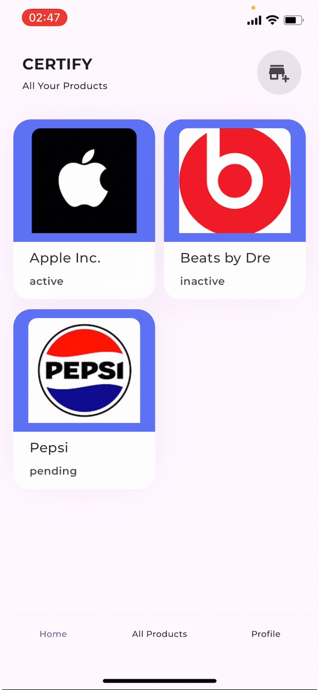
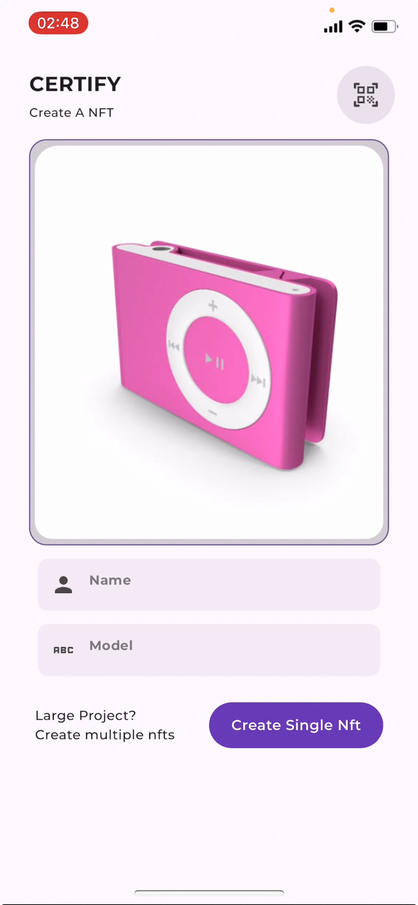
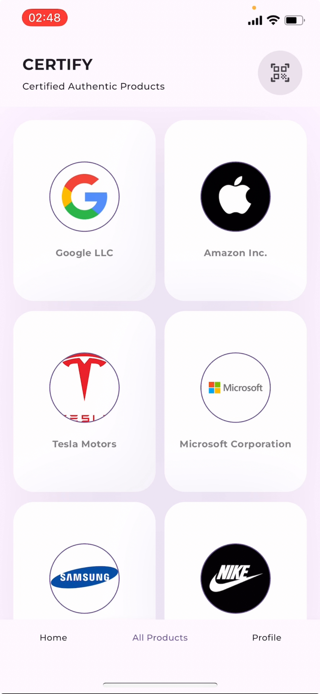
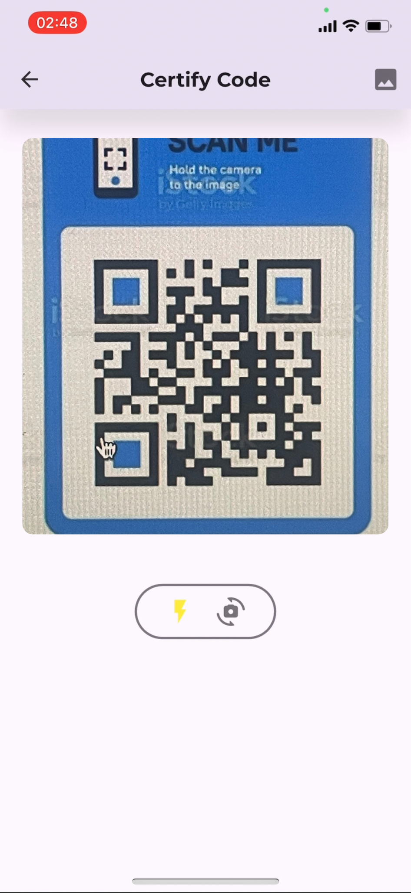
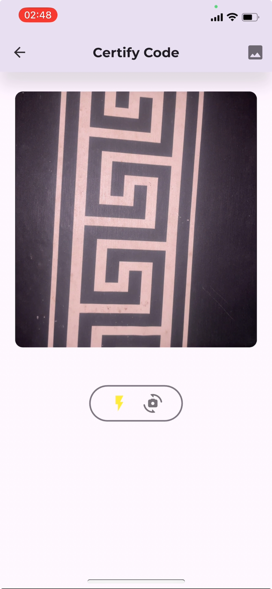

# Certify

## Overview


Certify is a revolutionary app designed to combat counterfeit products and ensure consumer safety. It's a digitalized version of the National Agency for Food & Drug Administration & Control (NAFDAC) in Nigeria, leveraging blockchain technology to provide a robust solution for product verification.

## Features

- **Digital Identity Creation:** Organizations can create blockchain-based digital identities for their products.
- **QR Code Generation:** Unique QR codes are generated for each digital identity, which can be attached to physical products.
- **Product Verification:** Users can scan QR codes to view the blockchain-verified information of products.
- **User-Friendly Interface:** Easy-to-use app for both organizations and consumers.
- **Blockchain Integration:** Utilizes blockchain technology for secure and transparent product verification.

## Upcoming Features

1. **ZK Implementation:** Enhancing security and scalability.
2. **Custom QR Codes:** Allowing organizations to customize their QR codes.
3. **Batch Identity Creation:** Ability to create multiple digital identities at once.

## Screenshots







Download the apk file here [https://drive.google.com/file/d/1gYEDREYV-EY-mHWyE9dYSVHWVXCI2_JX/view?usp=drive_link]

## Setup Instructions

### Prerequisites

- Flutter SDK (>=3.3.0 <4.0.0)
- Dart SDK

### Steps

1. **Clone the Repository**

   ```sh
   git clone [https://github.com/Immadominion/CERTIFY---THE-MVP.git]
   cd certify
   ```

2. **Install Dependencies**

   ```sh
   flutter pub get
   ```

3. **Run the App**
   ```sh
   flutter run
   ```

## Project Structure

```
lib/
|- main.dart
|- no_internet.dart.dart
|- core/
|  |- constants/
|  |- extensions/
|  |- theme/
|  |- utils/
|- data/
|  |- controllers/
|  |- local/
|  |- model_data/
|  |- repository/
|  |- services/
|- presentation/
|  |- general_components/
|  |- views/
|  |- splash.dart
|- utils/
   |- locator.dart
```

## Dependencies

- flutter_screenutil: ^5.9.0
- image_picker: ^1.0.7
- dio: ^5.4.1
- flutter_secure_storage: ^9.0.0
- get_it: ^7.6.7
- flutter_riverpod: ^2.4.10
- qr_code_scanner: ^1.0.1
- mobile_scanner: ^4.0.0
- pretty_qr_code: ^3.2.1
- lottie: ^2.4.0
- web3modal_flutter: ^3.3.4

[For a full list of dependencies, please refer to the pubspec.yaml file]

## Assets

The app uses various assets including animations and images. These are located in the `assets/` directory.

## Fonts

Certify uses the Montserrat font family with various weights and styles.

## Contributing

This information would be available soon!

## License

For the mvp version, liscensing has not been provided, but the code would be open sourced with a liscense

## Contact

having issues? reach out on telegram @immadotdev or @kingdominichan

---

Certify is the future of consumer safety and product authenticity. Join us in creating a safer, more transparent marketplace for all.
